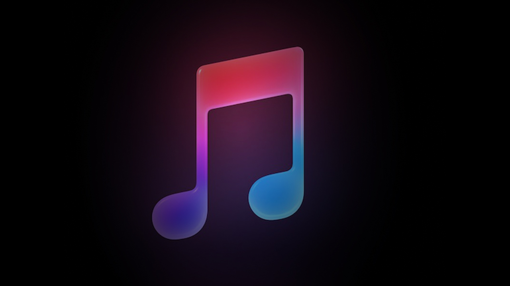

# RTMPS Music Streaming Server with Node.js



This project is a simple for RTMPS streams music using Node.js. The bot fetches and streams `.mp3` files from a directory on the server to users on RTMPS.

## Prerequisites

Ensure `ffmpeg` is installed on your server. You can install `ffmpeg` with the following commands:

**On Ubuntu:**

  ```bash
  sudo apt update
  sudo apt install ffmpeg
  ```

**On CentOS:**

```bash
  sudo yum install epel-release
  sudo yum install ffmpeg
  ```

## Installation
- Clone this repository:
  ```bash
  git clone https://github.com/habibi-dev/nodejs-music-stream.git
  cd nodejs-music-stream
  ```
- Install the required dependencies:
  ```bash
  npm install
  ```
- Copy the .env.example file to .env and update the environment variables:
  ```bash
  cp .env.example .env
  ```
  - In the .env file, set the value of DIR to the absolute path of the directory containing your .mp3 files. Make sure this folder only contains .mp3 files.
- Run the bot:
  ```bash 
  npm start
  ```

## Environment Variables
- ```STREAM_KEY:``` 
  - This is your unique stream key used for authenticating and identifying your stream on the platform. Keep this value secret, as anyone with access to it can stream to your channel. For example, this is provided by platforms like YouTube, Twitch, or Telegram when setting up a stream.

- ```SERVER_URL:```
  - The URL of the RTMP (Real-Time Messaging Protocol) server to which you will send your stream. It typically includes the protocol (rtmp or rtmps for secure streaming) and the server address where the stream will be broadcast. For example, it could be a Telegram or YouTube RTMP server.

- ```DIR:``` <br/>
  - The directory that contains your media files. The full path should point to a folder where the .mp3 files are stored. This directory is used by the application to load and stream the audio files.

- ```MEDIA_TYPE:```
  - Specifies the type of media to be streamed. Possible values are video or audio. If you are streaming audio-only (with an optional cover image), use audio. If you are streaming a full video, use video.

- ```COVER:```
  - Path to the image file that will be used as a cover in case of an audio stream or as a static image in video streams. This image is recommended to be 1280x720 pixels in size for HD quality.

- ```AUDIO_CODEC:```
  - Defines the codec used for audio encoding. The default is typically aac, which provides good compression with high sound quality and is widely supported.

- ```AUDIO_SAMPLE_RATE:```
  - Sets the sample rate for the audio stream, measured in Hz. Common values are 44100 (CD quality) or 48000 (DVD quality), and this determines how often samples of the audio are taken per second.

- ```AUDIO_CHANNELS:```
  - The number of audio channels in the stream. Use 1 for mono audio (single channel) and 2 for stereo audio (dual channel, more immersive sound).

- ```AUDIO_BITRATE:```
  - The bitrate for audio encoding, which controls the audio quality and bandwidth usage. Higher values (like 192k) offer better audio quality but consume more bandwidth, while lower values reduce quality and bandwidth usage.

- ```SCALE:```
  - Defines the output resolution of the video stream in width:height format. For HD streams, you can use 1280:720. This setting is only applicable if you are streaming video and want to control the resolution.

- ```IGNORE_DIRECTORIES:```
  - List of directories to be ignored during the streaming process.
  - Use this field to specify directories that should be excluded from streaming.